<!--
_class: top
-->


# 2023年モダンCSSの最新トレンド


---

<!--
_class: message
-->

# 新しい CSS が日々生まれている

新しい CSS を学ぶメリットとは？

---

<!--
_class: message
-->

# 長い JavaScript で実現していたものが、<br>短い CSS で済む

---

<!--
_class: message
-->

# 読みやすいコードになり、<br>開発者体験（DX）が向上する

---

<!--
_class: message
-->

# DX の向上により、<br>制作物の品質が向上する

---

<!--
_class: chapter
_header: 01
-->

# いま全ブラウザで使えるモダン CSS

---

<!--
_class: title
-->

# テキストのグラデーションを<br>画像なしで行いたい

`background-clip: text;`

---

<!--
_footer: https://www.apple.com/ipad-pro/
-->

# Apple のウェブサイトのグラデーション文字

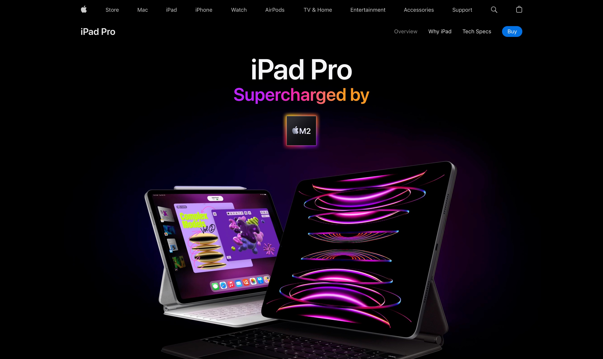

---

<!--
_footer: https://www.messenger.com/
-->

# Facebook messenger のグラデーション文字

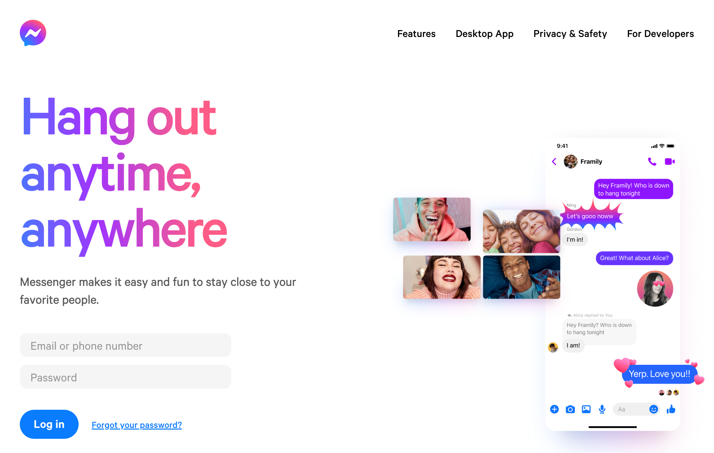

---

# 従来: Illustrator 等で画像を作っていた

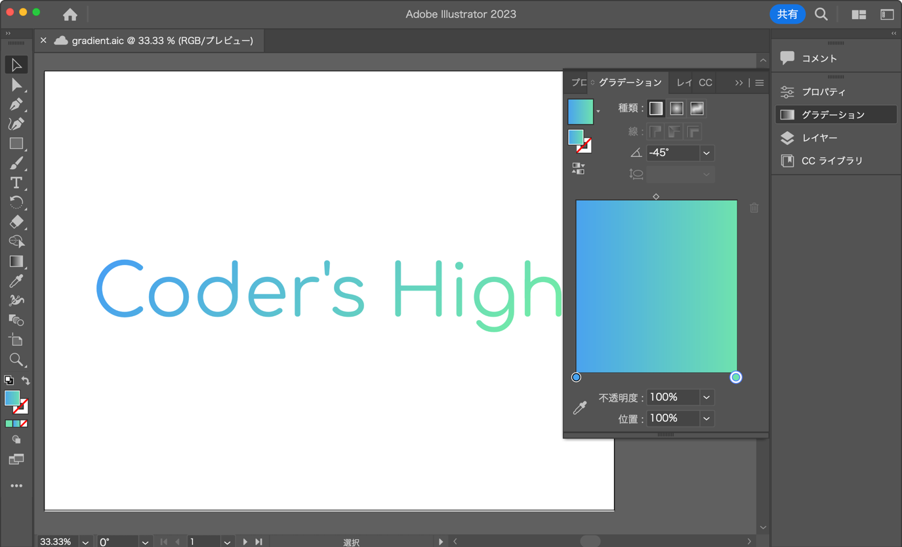

---

# 現代: background-text で指定できる

```css
p {
  /* 背景グラデーション */
  background: linear-gradient(-45deg, #2af598, #009efd);
  /* テキストの形に背景を切り抜く */
  -webkit-background-clip: text;
  background-clip: text;
  /* テキストの色を透明にする */
  color: transparent;
}
```

---

<!--
_class: external-demo
-->

# Demo

https://codepen.io/tonkotsuboy/pen/yLRYQeW

---

<!--
_class: title
-->

# すりガラス表現

backdrop-filter

---

# すりガラス表現をしたい

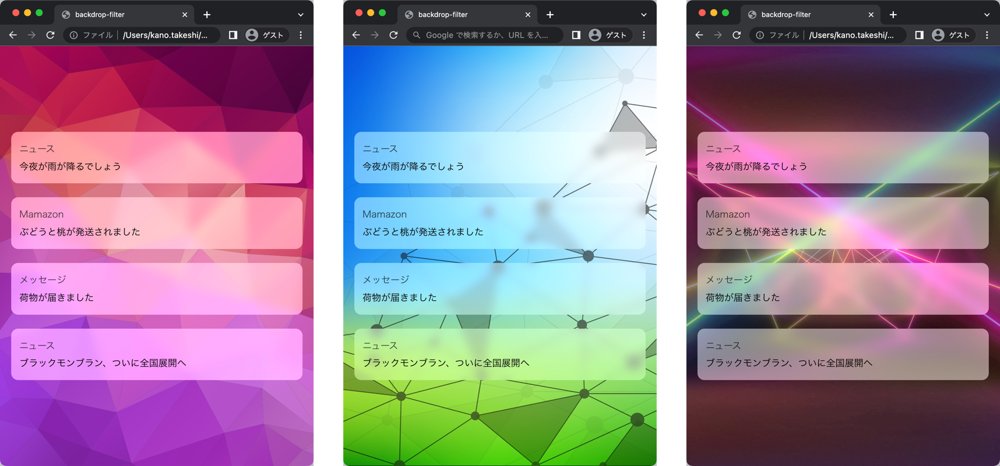

---

# 従来: Photoshop 等で画像を作成していた

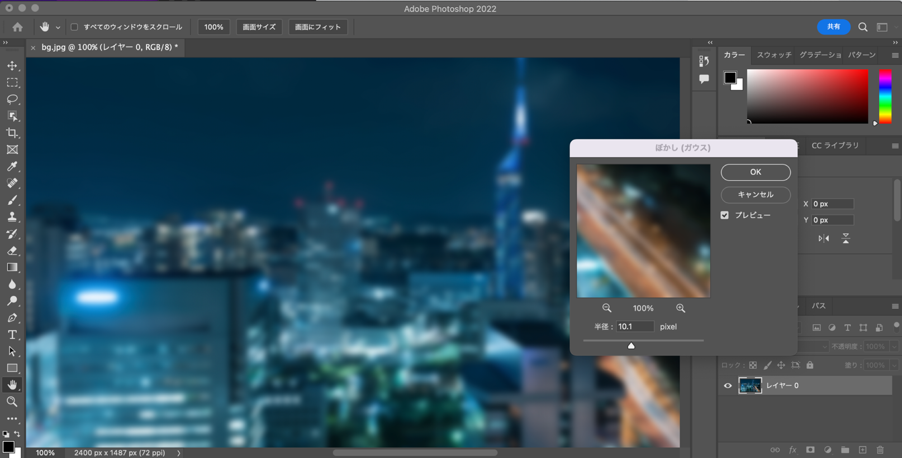

---

# 現代：`backdrop-filter`を使う

```css
.box {
  -webkit-backdrop-filter: blur(8px);
  backdrop-filter: blur(8px);
  background-color: rgba(255, 255, 255, 0.5);
}
```

- 景色は透明か半透明にする
- Safari のみベンダープレフィックス `-webkit-` が必要

---

<!--
_class: external-demo
-->

# Demo

https://codepen.io/tonkotsuboy/pen/MWPKWrW

---

<!--
_class: title
-->

# @media の 長い記法をやめたい

`@media (600px <= width < 1200px) {}`

---

# 従来 `min-width`, `max-width`, `and` を使っていた

```css
/* 画面サイズ 600px 未満 */
@media (max-width: 599px) {
}

/* 画面サイズ 600px 以上 1200px 未満 */
@media (min-width: 601px) and (max-width: 1200px) {
}

/* 画面サイズ 1200px 以上 */
@media (min-width: 1201px) {
}
```

---

<!--
_class: only-text
-->

# 従来: 「未満」や「より大きい」の表現ができない

- `min-width`: ○○px 以上
- `max-width`: ○○px 以下

---

# 従来: 「未満」や「より大きい」の表現ができない

▼ 600px 以上と未満でスタイルを切り替える場合の回避策

```css
@media (max-width: 599.99px) {
  /* 600px 未満のスタイル */
}

@media (min-width: 600px) {
  /* 600px 以上のスタイル */
}
```

---

# 現代: `<` や `<=` が使える

```css
/* 画面サイズ 600px 未満 */
@media (width < 600px) {
}

/* 画面サイズ 600px 以上 1200px 未満 */
@media (600px <= width < 1200px) {
}

/* 画面サイズ 1200px 以上 */
@media (1200px <= width) {
}
```

---

<!--
_class: only-text
-->

# 現代: 「未満」や「より大きい」の表現が可能

| 記号 | 説明       |
| ---- | ---------- |
| `<=` | 以下       |
| `<`  | 未満       |
| `>=` | 以上       |
| `>`  | より大きい |

---

<!--
_class: external-demo
-->

# Demo

https://codepen.io/tonkotsuboy/pen/JjmYWmw

---

<!--
_class: title
-->

# レスポンシブ対応で、<br>画像の縦横比を変えたい

`aspect-ratio`

---

# いろんなアスペクト比で画像を表示したい

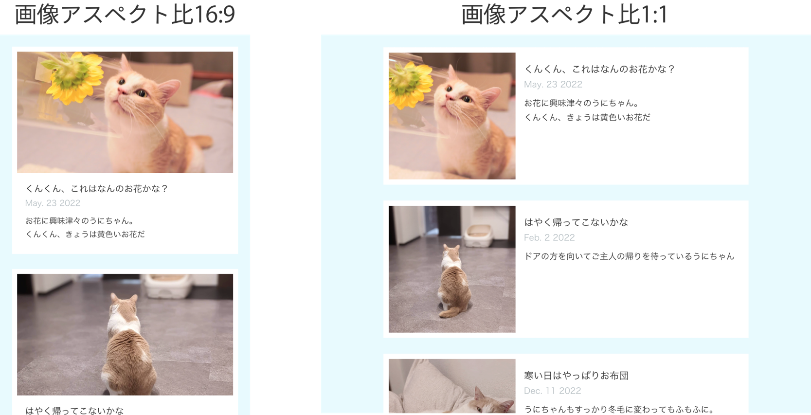

---

# アスペクト比とは

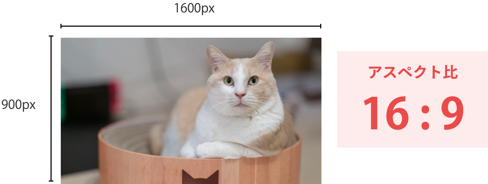

---

# 従来: `padding` ハック

```css
.box::before {
  content: "";
  display: block;
  padding-top: calc(100% * 9 / 16);
  /* 56.25% */
}

@media (width <= 500px) {
  .box::before {
    padding-top: calc(100% * 3 / 4);
  }
}
```

---

# 現在: `aspect-ratio` プロパティ

```css
.item {
  aspect-ratio: 16 / 9;
}

@media (width <= 500px) {
  .item {
    aspect-ratio: 4 / 3;
  }
}
```

---

<!--
_class: external-demo
-->

# Demo

https://codepen.io/tonkotsuboy/pen/JjmYWmw

---

<!--
_class: title
-->

# スクロール位置をぴたっと止める

Scroll Snap

---

<!--
_class: inline-demo
-->

# カルーセルで、スクロール位置をピタッと止めたい

<iframe style="width: 100%; height: 70%; border: none" src="https://cdpn.io/pen/debug/jOeEXrw"></iframe>

---

# 従来: JavaScript を使っていた

```js
const carousel = document.querySelector(".carousel");
const items = carousel.querySelectorAll(".item");
const currentIndex = 0;

carousel.addEventListener("scroll", (event) => {
  // スクロール位置を計算し、アイテムにスナップさせる
});
```

---

# 現在: `scroll-snap` プロパティを使える

```css
.container {
  /* x方向で、必ずスナップポイントに揃うように */
  scroll-snap-type: x mandatory;
}

.container .item {
  /* スナップ位置は、開始位置 */
  scroll-snap-align: start;
}
```

---

<!--
_class: external-demo
-->

# Demo

https://codepen.io/tonkotsuboy/pen/jOeEXrw

---

<!--
_class: title
-->

# アンカーリンクで<br>スムーススクロールがしたい

scroll-behavior

---

# アンカーリンクでスムーススクロール

<iframe style="width: 100%; height: 80%; border: none" src="https://cdpn.io/pen/debug/zYmvJMa"></iframe>

<!-- _footer: 右上のリンクをクリックしてみてください -->

---

# 従来: JavaScript で実装していた

```html
<!-- HTML -->
<head>
  <script src="jquery-3.6.0.js"></script>
  <script src="smooth-scroll.min.js"></script>
</head>
```

```js
// JavaScript
new SmoothScroll('a[href*="#"]');
```

---

# 現在: `scroll-behavior` で実装できる

```css
/* CSS */
html {
  scroll-behavior: smooth;
}
```

---

# `scroll-margin-top` でスクロール位置調整

```css
header {
  height: 60px;
}

section {
  /* 停止位置は60px  */
  scroll-margin-top: 60px;
}
```

---

<!--
_class: external-demo
-->

# Demo

https://codepen.io/tonkotsuboy/pen/zYmvJMa

---

<!--
_class: chapter
_header: 02
-->

# 今後使えるようになる CSS

---

<!--
_class: title
-->

# 子要素の状態に応じて、<br>親要素のスタイルを変えたい

`:has()`

---

# メールアドレスの有効・無効でラベルを変えるデモ

<iframe style="width: 100%; height: 80%; border: none;" width="100vw" height="100dvh" scrolling="no" title=":has() mailaddress" src="https://codepen.io/tonkotsuboy/embed/rNqxaQJ?default-tab=css%2Cresult" frameborder="no" loading="lazy" allowtransparency="true" allowfullscreen="true">
  See the Pen <a href="https://codepen.io/tonkotsuboy/pen/rNqxaQJ">
  :has() mailaddress</a> by Takeshi Kano (<a href="https://codepen.io/tonkotsuboy">@tonkotsuboy</a>)
  on <a href="https://codepen.io">CodePen</a>.
</iframe>

<!-- _footer: Firefox以外でご覧ください -->

---

# メールアドレスの有効・無効でラベルを変えるデモ

- input は有効（`:valid`）か無効（`:invalid`）になる
- それに応じて、`form`や`label`のスタイルを変えたい

```html
<!-- html -->
<form class="form">
  <label>メールアドレス</label>
  <input type="email" />
</form>
```

---

<!--
_class: only-text
-->

# 従来: JavaScript を使っていた

- `input` の状態が変更されるイベントをチェック
- `form` および `label`のスタイルを JavaScript で更新

---

# ミライ: `:has()` を使う

```css
.form:has(input:valid) {
  color: rgb(76, 175, 8); /* テキストを緑 */
  background-color: rgba(76, 175, 8, 0.1); /* 背景を薄緑 */
}

.form:has(input:invalid) {
  color: rgb(217, 4, 41); /* テキストを赤色 */
  background-color: rgba(217, 4, 41, 0.1); /* 背景を薄赤色 */
}
```

※ `.form:has(input:invalid:not(:placeholder-shown, :focus))`が better

---

<!--
_class: external-demo
-->

# Demo

https://codepen.io/tonkotsuboy/pen/rNqxaQJ

---

# `:has()` のサポート状況

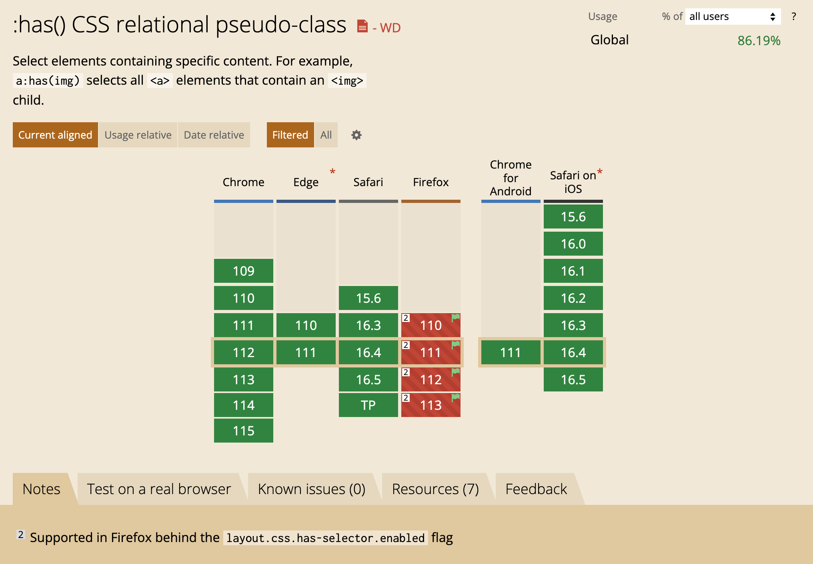

<!-- _footer: https://caniuse.com/css-has  -->

---

<!--
_class: title
-->

# Sass ではなく、<br>CSS でネスト（入れ子）にする

---

# 従来: Sass を使うしかなかった

```css
/* Sassファイル */
.container {
  .child {
    color: red;
  }
}
```

---

# ミライ: 「CSS」で実現できる

```css
/* CSSファイル */
.container {
  .child {
    color: red;
  }
}
```

---

# CSS ネストは、Sass のネストと「ほぼ」同じ

```scss
container {
  .child1,
  .child2 {
    color: red;
  }
}
```

```scss
.link {
  &:hover,
  &:active {
    color: red;
  }
}
```

---

# とくに、 @media のネストが便利

```scss
.box {
  color: blue;

  @media (width <= 800px) {
    color: red;
  }
}
```

---

# ネスト のサポート状況

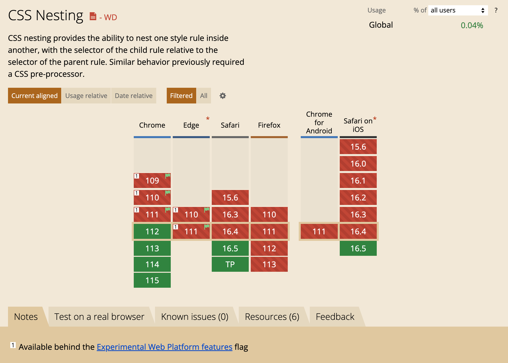

<!-- _footer: https://caniuse.com/css-nesting  -->

---

# PostCSS を使えば、今すぐ全ブラウザで使える

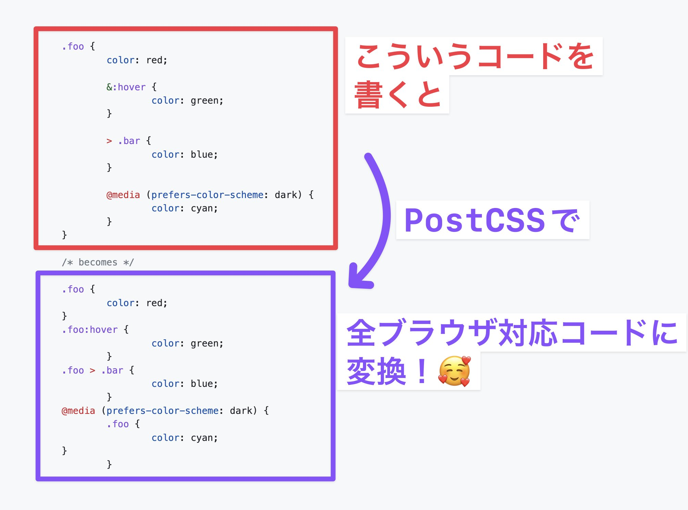

<!-- _footer: https://github.com/csstools/postcss-plugins/tree/main/plugins/postcss-nesting -->

---

<!--
_class: external-demo
-->

# Demo

https://codepen.io/tonkotsuboy/pen/ExRbPgV

---

<!--
_class: title
-->

# レンガ状のレイアウト

CSS Grid の masonry

---

# pinterest みたいなレイアウトを作りたい


<!-- _footer: https://www.pinterest.jp/ -->

<!-- カード型のコンテンツをレンガ状に敷き詰めるというセリフ -->

---

# 従来: `column`で（一応）実装できる

```css
:root {
  --gap: 24px;
}

.container {
  /* カラム数成り行き、基本的に300pxの横幅 */
  columns: auto 300px;
  /* 列間の隙間 */
  column-gap: var(--gap);
}

.item {
  /* 行間の隙間 */
  margin-bottom: var(--gap);
}
```

---

# ミライ： masonry を使う

```css
.container {
  display: grid;
  /* 行のレイアウトとして「masonry」を指定する */
  grid-template-rows: masonry;
  grid-template-columns: repeat(auto-fill, minmax(360px, 1fr));
  /* 親へgapを指定するだけでOK */
  gap: 40px;
}
```

---

# masonry のサポート状況

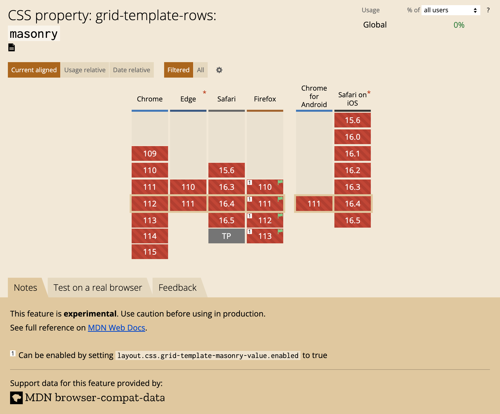

<!-- _footer: https://caniuse.com/mdn-css_properties_grid-template-rows_masonry  -->

---

<!--
_class: external-demo
-->

# Demo

https://codepen.io/tonkotsuboy/pen/jOKJXEm

---

<!--
_class: chapter
_header: 03
-->

# まとめ

---

<!--
_class: only-text
-->

# いま全ブラウザで使えるモダン CSS

- テキストのグラデーションを画像なしに行う `background-clip: text`
- すりガラス表現 `backdrop-filter`
- @media で `<` や `<=` が使える
- 画像の縦横比を変えたい `aspect-ratio`
- スクロール位置をピタッと止める `scroll-snap`
- ページ内リンクをなめらかにスクロール `scroll-behavior`

---

<!--
_class: only-text
-->

# 今後使えるようになる CSS

- 子要素に応じて親のスタイルを変えられる `:has()`
- CSS のネスト
- レンガ状レイアウト CSS Grid の `masonry`

---

<!--
_class: message
-->

# 新しい知識を取り入れて<br>楽しくラクにウェブ制作をしましょう

---

<!--
_class: finish
-->

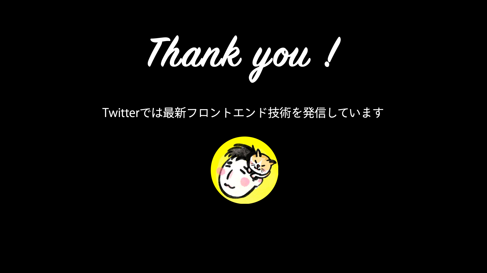

# [@tonkotsuboy_com](https://twitter.com/tonkotsuboy_com)
